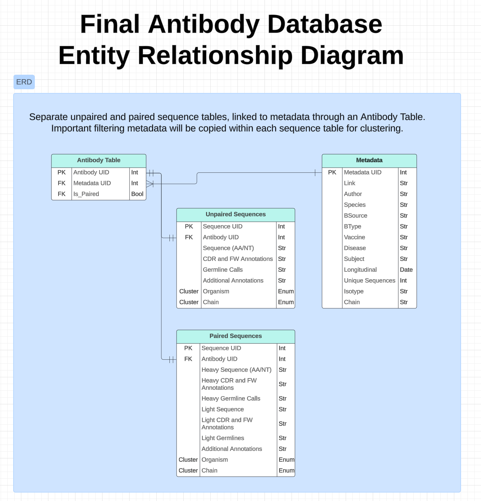

# Observed Antibody Space Sequence Onboarding

Onboarding of the Observed Antibody Space sequencing data to the Profluent HCP environmnent

## Background

The Observed Antibody Space database, or OAS, is a project to collect and annotate immune repertoires for use in large-scale analysis. It currently contains over one billion sequences, from over 80 different studies. These repertoires cover diverse immune states, organisms (primarily human and mouse), and individuals. The OAS database provides clean, annotated, translated antibody repertoire data in a unified format that adheres to the AIRR-seq (Adaptive Immune Receptor Repertoire Sequencing) standards. OAS contains both unpaired VH and VL data, as well as paired VH/VL data. The amount of unpaired data is significantly larger due to higher throughput capabilities of Illumina sequencing versus 10xGenomics sequencing (required for paired chain data). 

A web interface and more information can be found at https://opig.stats.ox.ac.uk/webapps/oas/

## Relational Database ERD

Four major tables exist:

1. **Antibody Table**
   - Contains a unique identifier to each antibody sequence. An entity in the Antibody Table is defined as either an unpaired heavy or light chain, or a paired heavy and light chain.
   - Links each sequence to its relevant metadata
   - Also contains an *Is_Paired* attribute that provides information for linking to the Unpaired or Paired sequence table
2. **Metadata**
   - Contains metadata that is available with every OAS file
   - Contains a UID for each piece of metadata
   - Metadata provides additional relevant filtering parameters, including Species(Organism), BSource, Vaccination/Disease status, Isotype
3. **Sequences Table**
   - Contains the sequences and annotations for unpaired heavy or light chains. H/L chain data are organized with the same schema
   - Paired chain data will be parsed into individual heavy and light chains and uploaded individually. They will be linked by the same Antibody ID.

## Outline of Steps

1. Complete raw downloads of all relevant antibody information from OAS: paired, unpaired, human, mouse, etc.
2. Create processing scripts for OAS data
   - Assign UIDs to every sequence, metadata, and antibody 
   - Parse H/L chains from the paired sequence data, and properly assign both chains to the same antibody entity
3. ETL Data into BigQuery
   - Batching or parallelization of the upload
4. Querying BigQuery and downloading relevant data
5. Explore Dockerization and Automation of the whole process